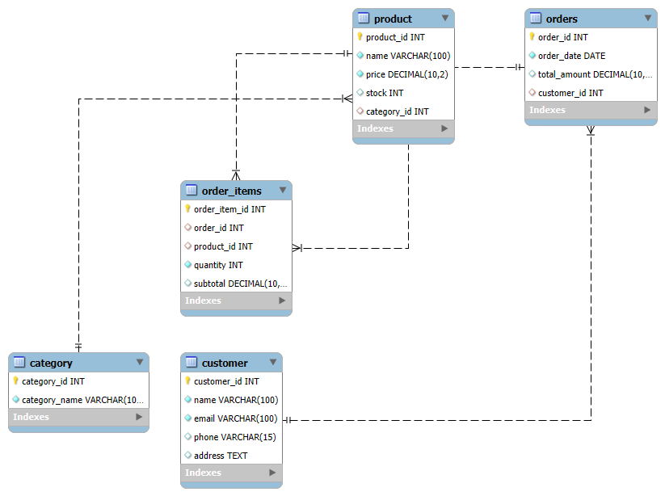

# E-commerce Database Schema Design

## 📘 Overview
This project demonstrates the creation of a fully functional **E-commerce Database Schema** using **MySQL Workbench**.  
The task focuses on designing entities, defining relationships, and implementing an SQL schema that models a real-world online shopping system.
---

## Database Setup
**Database Name:** `ecommerce_db`

**Tools Used:**  
- MySQL Workbench  
- SQL (DDL & DML)  
- ER Diagram (Reverse Engineered)

---

## Entities and Relationships
The database includes five main entities:

| Entity | Description |
|---------|--------------|
| **Customer** | Stores buyer details |
| **Category** | Groups products by type |
| **Product** | Contains product information |
| **Orders** | Represents purchase orders made by customers |
| **Order_Items** | Junction table connecting orders and products |

**Relationships:**
- One **Customer** can have many **Orders**  
- One **Order** can contain many **Order_Items**  
- Each **Product** belongs to one **Category**

---

## SQL Features Implemented
- Database creation using `CREATE DATABASE`
- Table creation using `CREATE TABLE`
- Primary & foreign key constraints
- Insertion of sample data (`INSERT INTO`)
- Data validation using `SELECT`, `DESC`, and `JOIN` queries

---

## ER Diagram
Below is the ER diagram generated using MySQL Workbench (Reverse Engineer feature):

---
